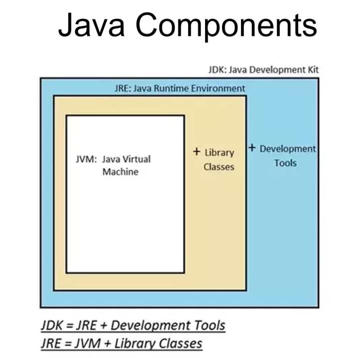
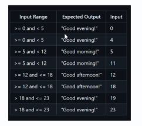
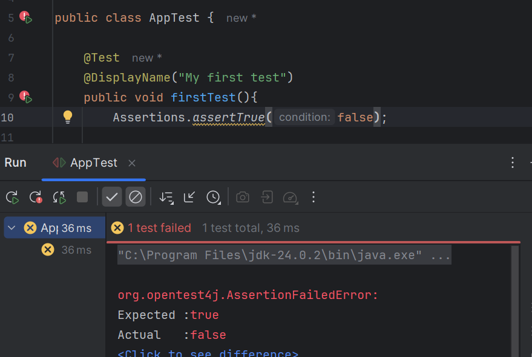
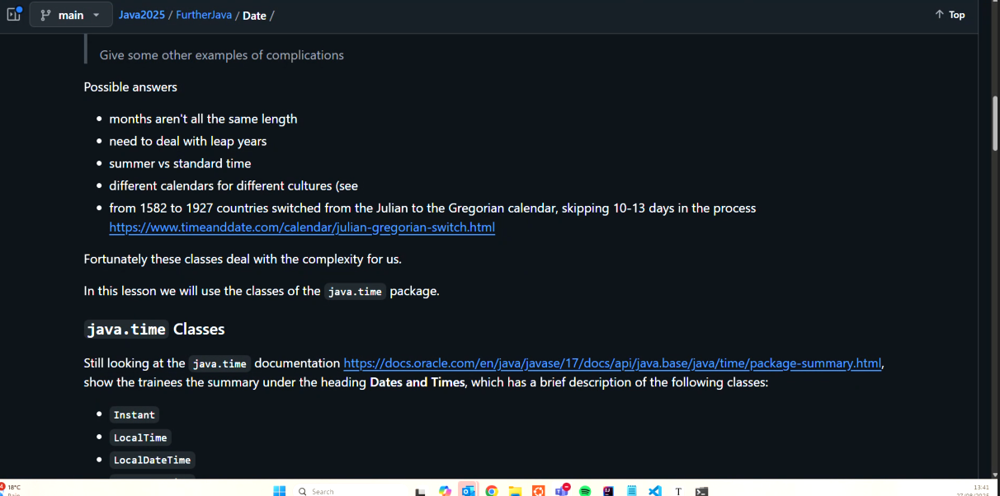
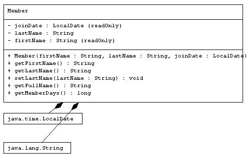

# Java upskilling notes

- [Java upskilling notes](#java-upskilling-notes)
  - [Basics](#basics)
  - [Memory model \& value and reference types](#memory-model--value-and-reference-types)
    - [Garbage collection](#garbage-collection)
  - [Naming conventions](#naming-conventions)
  - [Debugging in IntelliJ](#debugging-in-intellij)
  - [Conditionals](#conditionals)
  - [*pom.xml* file](#pomxml-file)
- [Testing with JUnit](#testing-with-junit)
  - [`@Test`](#test)
  - [`ParameterizedTest` (for ranges etc.)](#parameterizedtest-for-ranges-etc)
- [Data types](#data-types)
  - [Enums](#enums)
  - [Dates and times](#dates-and-times)
- [Methods](#methods)
  - [Constructor methods](#constructor-methods)
  - [Static methods](#static-methods)
  - [Built-in methods](#built-in-methods)
    - [Overriding `.equals()` and `.hashCode()`](#overriding-equals-and-hashcode)
  - [Abstract classes](#abstract-classes)
  - [`final` keyword](#final-keyword)
- [OOP](#oop)
  - [Encapsulation](#encapsulation)
    - [Access modifiers (for methods, classes, \& variables)](#access-modifiers-for-methods-classes--variables)
  - [Polymorphism](#polymorphism)
    - [Interfaces](#interfaces)
  - [Inheritance](#inheritance)
- [Helpful info](#helpful-info)
  - [IntelliJ plugins](#intellij-plugins)

## Basics



- the JDK includes everything needed to run your Java code
- once Java code (stored in *.java* files) is compiled (into *.class* files), it's in byte code, which is then converted into machine-readable code that can be read by different OSes
- when you run Java code, the JDK runs it on a virtual machine, which are different across OSes
- the `main` method of a class is where all the code runs from — i.e. it calls all the classes and libraries etc. needed to run an app
- methods should have a single responsibility to conform to SOLID principles
  - however, production code (e.g. for webapps) **doesn't have a `main` method** because it does not run as an independent thread; instead, it includes classes and methods which are all called somewhere else
- the **method signature** is the first line of code that creates it e.g. `public static void...`
- external libraries in IntelliJ hold code from the JDK
- **compiling** doe turns it into executable code
  - **running** code executes those executables
- use the wildcard `*` to import everything from a package, e.g. `import org.junit.jupiter.api.*`
- you can use `var` if you want Java to infer the data type of a variable
- if you want to rename something, right click it, choose *Refactor*, and rename it there — this way, it will rename it everywhere it's used
- **scope** in Java is outside of the curly brackets

## Memory model & value and reference types

- the RAM contains the stack and the heap
- depending on the Java data type, it will either be stored in the stack or the heap
- **stack**:
  - fast-access memory
  - last in, first out; when you leave the scope, everything is **popped** from it
- **heap**:
  - a larger area of memory holding data belonging to reference types
  - when a new reference type is created, the system finds space for it on the heap
- **value types**:
  - written in lowercase
  - smaller, simple data types with fixed sizes like int, char, boolean, enum, float
  - each variable has a copy of its own data
  - stored in the stack
- **reference types**:
  - written in title case
  - larger and have variable size
  - e.g. String, Integer, ArrayList
  - variables containing these data types contain a reference (i.e. an address) in the stack to where to find the data in the memory (the heap)
  - stored in the heap
  - use references because copying these may be quicker than copying the object itself (as they are larger)

### Garbage collection

- data stored on the heap that isn't linked to a variable (e.g. if it was originally but has been overwritten with a new value) is a **dead object**
  - the heap **regularly gets rid of dead objects** (via the **garbage collector**) to prevent them filling up the memory and free up memory
  - the garbage collector also moves live objects closer to each  other to optimise space (**compaction**)
- once you go out of scope (i.e. the curly brackets), data in the stack is removed (i.e. not accessible unless you go back into the previous scope)
- arguments used in method calls are *copied* into method's memory space as *local* parameters (either the value of the address is copied, depending on the argument's type)
  - if the argument is a value type and it's modified in the method, these modifications are local
  - if the argument is a reference type and modified, it will modify it globally (unless it has been reassigned to a new variable, which effectively copies the value of a reference type to a new memory address)

## Naming conventions

- packages are named like `com.sparta.fc.refactoring` as the dot notation creates multiple directories (i.e. *com/sparta/fc/refactoring* all within *src/*)
  - you could then also have a package called `com.sparta.fc.selection` which would be another subfolder under *fc/*
- classes are NamedLikeThis
- vars and methods are named likeThis

## Debugging in IntelliJ

- set a break point to stop the code from running past that point, and click *Debug*
- click *step into* to go into any method being called
- click *step over* to go to the next line

## Conditionals

- for simple if-else statements, use the **ternary operator** `?` like `condition ? <what to return if successful>: <what to return if not successful>;`
  - e.g. `mark>= 65 ? "Pass": "Fail";`
- you can also chain these by nesting like `1st condition ? (2nd condition ? <what to return if 2nd condition successful> : <what to return if 2nd condition not successful>) : <what to return if 1st condition is unsuccessful>` (though it's best not to as this is less readable)
  - e.g. `mark >= 65 ? (mark >= 85 ? "Distinction": "Pass") : "Fail";`

## *pom.xml* file

- ***pom.xml***: a fundamental Maven file that defines the config & dependencies for building a Java project
- within the file, you can right click, choose *Generate dependency*, and search for existing artifacts/classes to insert into the file (note that these use the naming format of `org.package.subpackage:version` e.g. `org.junit.jupiter:junit-jupiter:5.9.3`)
- once done editing the *pom.xml* file, click the little M icon in the right-hand corner to reload and download the new libraries

# Testing with JUnit

- developers write **unit tests** for code, testers do other types of testing
- **unit tests**: testing that the smallest testable parts of an app (.e.g functions/methods) work correctly in isolation
- **unit tests effectively document your code**, so they should cover all test boundaries 
- shouldn't be **any control flow logic in a test** — it should just test boundaries
- write unit tests to test edge cases (i.e. **boundary value analysis**) because exhaustive testing is impossible
- **boundary value analysis**: testing the boundaries of ranges (e.g. the minimum and maximum, and just outside the range) to ensure the code's logic is correct
  - example edge cases for `timeOfDay`: 
  - most errors cluster around boundaries of `>=` (i.e. because one value can be accounted for by 2 tests)
- follow the **arrange, act, assert** format to design tests

## `@Test`

- allocate a method as a test method by using `@Test` above the method (**this method is best for testing single values; see below for passing a set of values to a test**)
  - then give the test a **descriptive display name** in the general format of `@DisplayName("function, when given a value of x, returns y")
  - **also use a descriptive name for the test method itself**
- example:
```
@Test
@DisplayName("getGreeting, when given a time of 21, returns Good Evening")
public void getGreeting_GivenATimeOf21_ReturnsGoodEvening(){
        // Arrange
        int time = 21;
        String expected = "Good evening!";

        // Act
        String actual = App.getGreeting(time);

        // Assert
        Assertions.assertEquals(expected, actual);
    }
```
- note that the above can also be written in one line like `Assertions.assertEquals("Good evening", App.getGreeting(21));`
- example failing test 

## `ParameterizedTest` (for ranges etc.)

- **parameterised tests** allow you to test a method with a set of values via `@ValueSource`, not just one; e.g.:
```
@ParameterizedTest
    @ValueSource(ints = {5, 11})
    @DisplayName("getGreeting, when given a time from 5 to 11, returns Good morning!")
    public void getGreeting_GivenATimeFrom50To11_ReturnsGoodMorning(int time){
        Assertions.assertEquals("Good morning!", App.getGreeting(time));
    }
```
- for pairs of values, you can also use `CsvSource` instead of ValueSource (which only works with one dimension of values); e.g.:
```
@ParameterizedTest
    @DisplayName("getGreeting, when given a time, returns an appropriate greeting")
    @CsvSource({
            "Good evening!, 2",
            "Good morning!, 8",
            "Good afternoon!, 15",
            "Good evening!, 21"
    })
    public void givenATime_Greeting_ReturnsAnaAppropriateGreeting(String expected, int time){
        Assertions.assertEquals(expected, App.getGreeting(time));
    }
```
  - however, the testing best practice is to **split tests up so that they are readable and clearly document the code, so it's better to use `@ValueSource`**

# Data types

## Enums

- a group of constants (i.e. unchangeable variables)
  - helpful when you want to restrict values to a set list 
- naming convention for constant variables should be in upper case
- declare a class an Enum class
- there are existing Enums e.g. days of week
- defining constants starts with making them static and final
- defined like:
```
public enum SeasonsEnum {
        SPRING,
        SUMMER,
        AUTUMN,
        WINTER
    }
```
- you can loop through Enum values like:
```
for(SeasonsEnum season: SeasonsEnum.values()){
            System.out.println(season);
        }
```

## Dates and times

- **three classes for dates**:
  - `java.util.Date`
  -   `java.sql.Date`: a subclass of the above that conforms to the way dates are represented in SQL
  - `java.time.LocalDate` is the preferred method as many of the methods in `java.util.Date` are deprecated
-   

# Methods

## Constructor methods

- the constructor **must have the same name as the class** (so that it's called when a new object of the class is created)
- this method initialises an object instance of a class
- shortcut: right-click and choose *Generate* > *Constructor* to make a constructor method for a class
- **constructor chaining**: method overloading the constructor method so it takes less than the full number of parameters and provides a default value for the remaining params
  - this is also called compile-time polymorphism because, if you right click the use of a chained constructor method and click go to > implementations, you'll see that IntelliJ takes you to the correct constructor (and it knows to do this even before you have run the programme)
- if you don't add a constructor method to a class, by default, a parameter-less one is put into the class in the background
  - however, once you create another constructor, the parameter-less one will disappear (unless you recreate it explicitly like `public Member(){}`)

## Static methods

- belong to the class itself, not the instances, e.g. `Math.pow()` is static
- to use non-static methods, you have to create an object of the class first e.g. `Member me = new Member();`  

## Built-in methods

- these are inherited by everything from the Object class
- they can be overridden (if not `final` methods) to perform custom behaviour

- `.getClass()` returns the class of the object
- `.toString()` returns class and memory location of an object
- `.equals(x)` checks if two objects contain the same value 
- `.hashCode()` returns unique identifier for object

### Overriding `.equals()` and `.hashCode()`

- you must override both if you're going to override one because they're linked
- you can do this automatically by right-clicking and choosing *Generate* > *equals() and hashCode()*
- standard format of overriding `.equals()` so that it returns true when two objects with the same parameter values are the same (this is not the default):
```
public boolean equals(Object obj) {
        if (!(obj instanceof ExampleClass example))
            return false; // checking to see if obj is not an object of the ExampleClass class, but if it is, storing it in example variable
        else { // if it is an ExampleClass object
            return Objects.equals(this.firstName, example.firstName) && Objects.equals(this.lastName, example.lastName) && Objects.equals(this.joinDate, example.joinDate); // do this for every parameter taken by the ExampleClass
        }
    }
```
- standard format of overriding the `hashCode()` method so that it returns the same hash code if each of an object's parameter values are the same:
```
public int hashCode() {
        return Objects.hash(firstName, lastName, joinDate); // include every parameter taken by the given class (e.g. Member or Animal)
    }
```

## Abstract classes

- the purpose of abstract classes is to ensure that **they can't be instantiated as an object** — their purpose is ***to be derived from***
- they don't need constructors
- along with normal methods, you can also have abstract (i.e. empty) methods in an abstract class e.g. a `speak()` method in an abstract Animal class (empty because every derived class will speak differently)
  - the derived classes must then fill in the method
- example:
```
public abstract class Animal {
    public abstract String speak();
}
```

## `final` keyword

- if used on a class, it can't have any sub-classes ("vasectomy")
- if used on a variable, its value can never be changed

# OOP

- **abstraction**:
  - the concept of classes, which is that classes are blueprints of real-life objects (an object is an instance of a class)
- **encapsulation**:
  - concept of data hiding & exposing e.g. thru `private` & `public` methods & variables
- **polymorphism**:
  - different implementations of the same thing
  - has two types: **method overriding** & **method overloading** 
- **inheritance**:
  - a hierarchical relationship between classes (e.g. subclasses)

## Encapsulation

### Access modifiers (for methods, classes, & variables)

- these are how data is exposed & hidden

- **public**: accessible in any class or package
- **private**: accessible only within the same class (you can get around this in sub-classes using getters & setters)
- **protected**: accessible within the same package and sub-classes
- **default**: accessible only within the same package (doesn't need to be explicit stated as it's the default)

## Polymorphism

- different implementations of the same thing
- there are different types:
  - **method overriding:** creating a method with the same name & parameters as an existing inherited method, except it does something different — this is *run-time polymorphism*
  - **method overloading:** methods that have the same method signature, but take different (types or number of) parameters — this is *compile-time polymorphism*
- example of overriding a built-in method (`.toString()`):
```
public String toString(){
        return this.getFullName() + " has been a member for " + this.getMemberDays() + " days";
    }
```
- example of overriding an inherited method:
```
@Override
    public String toString(){
        return super.toString() + " and is a " + this.getPosition();
    }
```

### Interfaces

- single inheritance causes an issue if you want a class to inherit from multiple classes
- interfaces solve this issue by allowing classes to inherit from them (and there is no limit on them)
- interfaces are entirely abstract
- all their methods are abstract -- you just provide the return type and the method name like `void Printable();` or `String move();`
- you add them to a class like `public class exampleClass implements ExampleInterface` in the method signature
- if you implement an interface in a concrete class, you **must fill in (i.e. implement) its methods**
  - however, if you implement an interface in an abstract class, you don't need to implement (fill in) its methods as abstract classes take abstract methods

## Inheritance

- Java **only allows single inheritance, i.e. inheriting from one super-class**
- derived (child) classes are essentially **specialisations** of the super-class
- inheritance allows your code to remain DRY (don't repeat yourself)
- use `extends` in the class signature to establish the inheritance relationship
- sub-class constructors use the `super()` method not `this.` like:
```
public class BaseballMember extends Member{

    private String position; // new BaseballMember-specific variable

    public BaseballMember(String firstName, String lastName, int year, int month, int day, String position) {
        super(firstName, lastName, year, month, day); // inherited
        this.position = position; // BaseballMember-specific
    }
}
```
- the super-class can access all of the objects of its sub-class(es)
- sub-classes **cannot access private variables & methods from the super-class**
  - but they can access `protected` variables & methods
- any time you create a class, you inherit from the Object class, which has methods like `.clone()` and `.toString()`
  - some of these built-in methods are private, which mean you can't override them
- **note that you cannot inherit from `final` classes**

# Helpful info

## IntelliJ plugins

- UML Generator: creates UMLs (Unified Modelling Language) diagrams of classes and methods, e.g. 