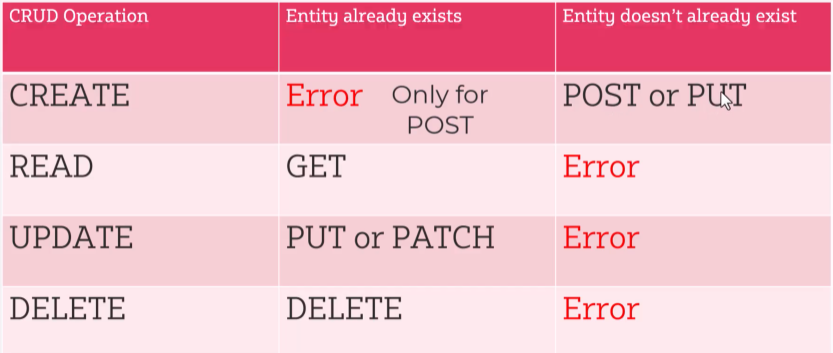
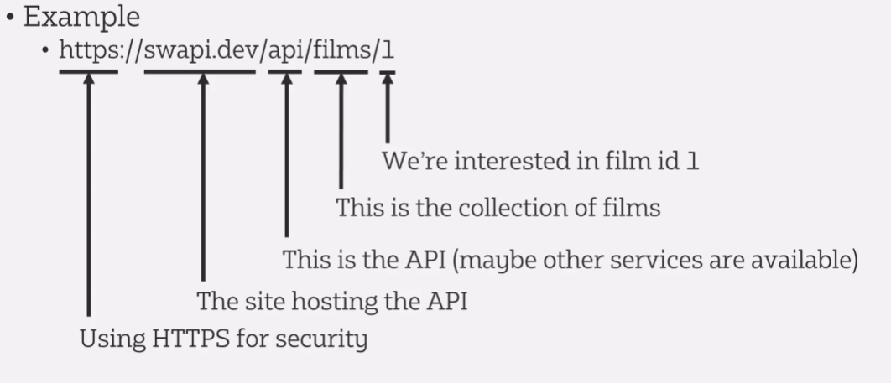

# REST API notes

- [REST API notes](#rest-api-notes)
  - [HTTP](#http)
  - [JSON](#json)
  - [REST API](#rest-api)
  - [REST implementation](#rest-implementation)

## HTTP

- 

## JSON

- 

## REST API

- **API**: a mechanism that allows two programs to communicate with each other
- **REST**: a particular architectural style for APIs
- used in both web & mobile apps to get data
- REST is very flexible
- **REST architecture**:
  - uses HTTP
  - client-server
  - stateless: no client-specific state info stored on the server (as with HTTP, which is inherently stateless)
  - ability to cache responses, avoiding network traffic
  - black box between client & server: client shouldn't know whether it's communicating directly with the REST API or an intermediary, & it shouldn't be aware of how the data it's accessing is stored (e.g. SQL database, HTML, etc.)
  - data format can be transferred to client in different format than it is in storage
  - provides a uniform interface
  - responses should be self-descriptive (e.g. via JSON key names)
  - hypertext-driven: responses often link to other data
- **why REST is popular**:
  - uses HTTP requests and responses, which is supported in all programming languages
  - especially easy to call on webpages in JavaScript code (as JSON is natively supported)
  - uses JSON, which has widespread support in programming languages
  - JSON is a simple text-based transfer format, so doesn't require a lot of special processing
  - a lot of languages support the development of REST APIs via libraries & frameworks
  - can be used to integrate different parts of app (e.g. user interface & data elements)
- **common REST technologies**:
  - messages are exchanged via HTTP
  - the service you want to access, actions you want to perform & target of the action is usually URIs (uniform resource identifiers) & HTTP methods (GET, POST, PUT, PATCH, DELETE)
  - JSON is most commonly used to represent data, but XML & HTML are sometimes too
  - a REST API can be described & documented with Swagger/OpenAPI

## REST implementation

- **CRUD** (create, read, update, delete): how we often access data in a data store (vast majority of REST APIs work like this)

- REST APIs provide CRUD access to a data store using HTTP for transport and JSON as the data structure
- **API endpoint**: the URL used to access an API, example (though can be more nested than this):

- HTTP response codes:
  - 200 OK
  - 201 Created
  - 400 Bad Request
  - 401 Unauthorised
  - 404 Not Found